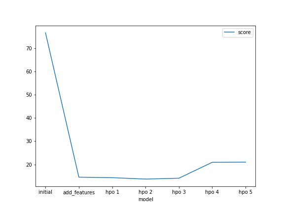
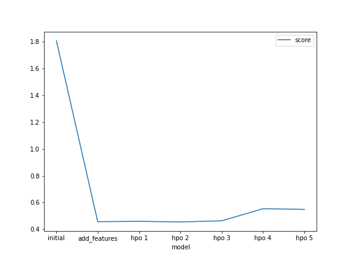

# Report: Predict Bike Sharing Demand with AutoGluon Solution
#### SAVINO GIUSTO

## Initial Training
### What did you realize when you tried to submit your predictions? What changes were needed to the output of the predictor to submit your results?
TODO: Add your explanation
When I started to analyze the Bike Sharing Demand Dataset I realized the it was a regression problem. I had to predict the number of total rentals per hour.
I noticed that the train dataset had the columns 'casual' and 'registered', instead the test dataset not. So I dropped these two columns before run the fit method of autogluon predictor. The same I did for predict method onto test dataset.
After run the predict method of predictor I noticed that the model predicted 77 bnegative values. Since we are trying to predict the hourly rental number of bike a negative values hasn't no meaning, so I set to zero all these values.

### What was the top ranked model that performed?
TODO: Add your explanation
The top ranked model was obtained with new features added

## Exploratory data analysis and feature creation
### What did the exploratory analysis find and how did you add additional features?
TODO: Add your explanation
I donwloaded the package pandas-profile to assist me in data exploratory (file name: Report_001.html)
From this report I acknowledge that I should add new features:
* year, month, day, hour, day of the week (I discated minute and second because they are all zeros)
* convert with one-hot-encoding the features season and weather
* normalized the columns temp, atemp, humidity and windspeed

Then I plot the histogram of features in train dataset:

### How much better did your model preform after adding additional features and why do you think that is?
TODO: Add your explanation
After made the changes above-mentioned, the root_mean_squared_error passed from 1.80551 to 0.45745
The better score depends on the new features. Before these changes the model fitting coudn't exploit the datetime information (it had uniform distribution, season and wheather encoding and normalization of temp, atemp, humidity and widspeed.

## Hyper parameter tuning
### How much better did your model preform after trying different hyper parameters?
TODO: Add your explanation
|Description|                              train_error|     kaggle_score|
|---|---|---|
|initial                         |76.53           |1.80551|  
|new_features                    |14.57           |0.45745|
|hpo 1: auto_stack = True        |14.36           |0.46036|
|hpo 2: time_limit = 1200        |13.76           |0.45565|
|hpo 3: time_limit = 1200 num_bag_folds=10 num_bag_sets=10 num_stack_levels=2 refit_full = True    |14.13           |0.46413|
|hpo 4: custom hyperparam nn_options = {'num_epochs': 10,'learning_rate': ag.space.Real(1e-4, 1e-2, default=5e-4, log=True), 'activation': ag.space.Categorical('relu', 'softrelu', 'tanh'),                    'dropout_prob': ag.space.Real(0.0, 0.5, default=0.1),} }gbm_options ={'num_boost_round': 100,'num_leaves': ag.space.Int(lower=26, upper=66, default=36),} |      20.96           |0.55408|
hpo 5: custom hyperparam type 2 'num_epochs': 100, 'learning_rate': ag.space.Real(1e-5, 1e-2, default=5e-4, log=True),  |        21.04    |       0.54929
        

### If you were given more time with this dataset, where do you think you would spend more time?
TODO: Add your explanation
Try more combination of hyperparameter for the models of hyperparameter of each model like in test hpo 4 and 5.

### Create a table with the models you ran, the hyperparameters modified, and the kaggle score.
|model|hpo|score|
|---|---|---|
|0|initial|1.80551|
|1|add_features auto_stack=True|	0.45745|
|2|hpo 1 time_limit = 1200|	0.46036|
|3|hpo 2 num_bag changing|	0.45565|
|4|hpo 3 custom hyperparam_1|	0.46413|
|5|hpo 4 custom hyperparam_2|	0.55408|
|6|hpo 5 tune the hyperparameter|	0.54929|

### Create a line plot showing the top model score for the three (or more) training runs during the project.

TODO: Replace the image below with your own.

### Create a line plot showing the top kaggle score for the three (or more) prediction submissions during the project.

TODO: Replace the image below with your own.

## Summary
TODO: Add your explanation
It seems that I get the best result after add new features. Hyperparameters tuning seems didn't get any better results
